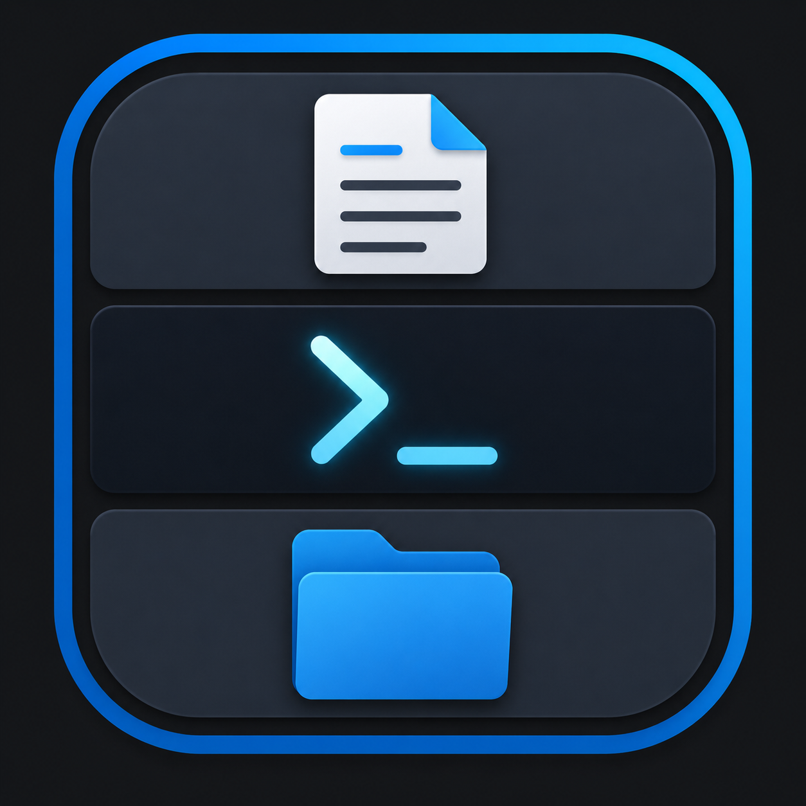

<h1 align="center">
  
  &nbsp;CC Workspace
</h1>

<p align="center">
  <strong>Memo · PowerShell · Folder — all in one window.<br>
  An all-in-one 3-pane desktop workspace for Claude Code.</strong>
</p>

<p align="center">
  <a href="#-quick-start"></a>
  <a href="#-build--distribution"></a>
  <a href="#-license"></a>
</p>

<p align="center">
  
  
  
  
  
</p>

<p align="center">
  <strong>🇺🇸 English</strong> &nbsp;·&nbsp; <a href="README_kr.md">🇰🇷 한국어</a>
</p>

---

> **In one line** — launch the app and **Memo (top) · PowerShell (middle) · Folder (bottom)** appear together in a single window.
> The middle pane is **a real PowerShell**, not a mock — type `claude` in it and Claude Code runs right there.

<!-- To add a screenshot, save it as assets/screenshot.png and uncomment the line below -->
<!-- <p align="center"></p> -->

```
┌─────────────────────────────────────┐
│ 📝 Memo                 [Open][Save] │  ← text memo · open / save file
├─────────────────────────────────────┤
│ ⌨  PowerShell                        │  ← real shell · run claude
│ PS C:\Users\you>                     │
├─────────────────────────────────────┤
│ 📁 Folder                            │  ← click = select · double-click = enter
└─────────────────────────────────────┘
```

---

## ✨ Features

| Area | What it does |
|------|------|
| 📝 **Memo** | Text editing · open file (`Ctrl+O`) · save (`Ctrl+S`, overwrites the open file) · save as (`Ctrl+Shift+S`) · current filename shown in the header |
| ⌨ **Terminal** | Real PowerShell (xterm + node-pty). Two-way input / output / resize. Run `claude` to use Claude Code |
| 📁 **Folder** | Single click = select (highlight) · double click = enter folder / open file · `..` = go up · `Ctrl+Shift+C` = copy path |
| 🧭 **Menu** | "File" (New Window / Open / Save / Save As / Exit) · "View" (Reload / DevTools / Zoom) |
| 🪟 **Multi-window** | "File > New Window" (`Ctrl+N`) opens multiple windows. Each has its own PowerShell · memo · folder |

---

## 🚀 Quick Start

### Prerequisites

- [Node.js (LTS)](https://nodejs.org) — that's all you need. **No Visual Studio compiler required** (the terminal module uses an N-API prebuilt).

### Install & Run

```powershell
git clone https://github.com/AnsibleMage/cc-workspace.git
cd cc-workspace
npm install
npm start
```

`npm start` brings up the 3-pane window right away.

> ⚠️ **Watch the clone path** — if the path contains **spaces** (e.g. `C:\my projects\`), the Electron install can break.
> Clone into a **space-free path** like `C:\dev\cc-workspace`. ([see Troubleshooting ② below](#-troubleshooting))

---

## 📦 Build & Distribution

```powershell
npm run dist:portable   # single portable EXE (recommended)
npm run dist            # portable + installer + win-unpacked
```

Build artifacts are generated in `dist/`.

| Artifact | How to distribute |
|------|------|
| **`CC-Workspace-Portable-1.0.0.exe`** (~68MB) | Hand over **just this one file** → double-click → it runs (no install, no Node) |
| **`dist/win-unpacked/`** | Zip the whole folder → unzip and run `CC Workspace.exe` (faster, no self-extraction) |
| `CC Workspace Setup 1.0.0.exe` | Installer (desktop / Start-menu shortcuts) |

<details>
<summary>📌 How the portable EXE works / notes for recipients</summary>

<br>

- **No install concept** — on launch it briefly extracts to `%TEMP%` and runs there. Nothing is left in Program Files, the registry, or the Start menu. To remove it, just delete the EXE.
- **Recipients need nothing** — no Node, no developer mode, no build tools.
- On first run a **SmartScreen ("Windows protected your PC")** warning may appear (unsigned personal app) → **More info → Run anyway**.
- To use `claude` in the middle pane, Claude Code must be installed separately on that PC (the app only provides the terminal).

> Note: the PC that **builds** the EXE needs Windows **Developer Mode** ([Troubleshooting ③](#-troubleshooting)).

</details>

---

## 🧩 Architecture

```
cc-workspace/
├── main.js          # main process: window creation · PowerShell (pty) · file IPC · menu
├── renderer.js      # renderer: terminal / memo / folder UI logic
├── index.html       # 3-pane layout
├── styles.css       # dark theme
├── package.json     # dependencies + electron-builder config
├── build/icon.ico   # build icon (multi-resolution)
├── README.md        # English (this file)
├── README_kr.md     # Korean / 한국어
└── HANDOFF.md       # work log / trap details
```

**IPC channels** — `pty:data`/`pty:input`/`pty:resize` (terminal) · `fs:list`/`fs:open` (folder) · `memo:open`/`memo:save` (memo) · `menu:open`/`menu:save`/`menu:saveAs` (menu)

---

## 🛠 Tech Stack

| Category | Choice | Notes |
|------|------|------|
| Framework | Electron 30.5.1 | terminal embedding + fast iteration |
| Terminal | xterm 5.3 + **@lydell/node-pty** | N-API prebuilt → no compilation |
| Packaging | electron-builder 24.13.3 | portable / installer / folder in one go |

---

## ⚠️ Troubleshooting

> The 3 walls actually hit while building this app. You may hit the same ones on reinstall / rebuild.

<details>
<summary><strong>① Terminal module compile failure (no Visual Studio)</strong></summary>

<br>

`node-pty` / `@homebridge/node-pty-prebuilt-multiarch` need C++ compilation or lack an Electron 30 prebuilt, so they fail.
→ Switched to **`@lydell/node-pty`** (N-API). Just `npm install` — no compilation, no rebuild.

</details>

<details>
<summary><strong>② Electron extraction failure (spaces in the path)</strong></summary>

<br>

**Symptom:** `npm start` → `Electron failed to install correctly`. `node_modules\electron\dist` exists but `electron.exe` is missing.
**Cause:** **spaces** in the project path make the zip extraction silently fail (the download itself is fine).
**Manual fix:**

```powershell
$zip = (Get-ChildItem "$env:LOCALAPPDATA\electron\Cache" -Recurse -Filter "*.zip" | Select-Object -First 1).FullName
Remove-Item -Recurse -Force "$env:TEMP\el-test" -ErrorAction SilentlyContinue
Expand-Archive -Path $zip -DestinationPath "$env:TEMP\el-test" -Force
Remove-Item -Recurse -Force node_modules\electron\dist -ErrorAction SilentlyContinue
New-Item -ItemType Directory -Force node_modules\electron\dist | Out-Null
Copy-Item "$env:TEMP\el-test\*" "node_modules\electron\dist\" -Recurse -Force
"electron.exe" | Out-File -Encoding ascii -NoNewline node_modules\electron\path.txt
```

**Root fix:** move to a space-free path (e.g. `C:\dev\cc-workspace`).

</details>

<details>
<summary><strong>③ winCodeSign symlink failure when building the EXE</strong></summary>

<br>

**Symptom:** `npm run dist` → `Cannot create symbolic link … the client does not have the required privilege`.
**Cause:** Windows blocks symlink creation under normal privileges.
**Fix:** **Turn on Windows Developer Mode** (Settings → System → For developers → Developer Mode), then:

```powershell
Remove-Item -Recurse -Force "$env:LOCALAPPDATA\electron-builder\Cache\winCodeSign" -ErrorAction SilentlyContinue
npm run dist:portable
```

> Developer Mode is only needed on the **building** PC. Recipients don't need it.

</details>

---

## 🗺 Roadmap

- [ ] Drag pane borders to resize
- [ ] Memo auto-save / Markdown preview
- [ ] Persist folder start path in settings
- [ ] Code signing (remove the SmartScreen warning)
- [ ] Auto-update (`electron-updater`)

---

## 🧾 Changelog

### v1.0.0 — 2026-06-29 (first release)

- 🎉 Initial release
- 3-pane layout (Memo · PowerShell · Folder)
- Memo open / save (overwrite) / save as
- Folder browsing (click to select · double-click to enter · `Ctrl+Shift+C` to copy path)
- Menu (File / View) · custom icon
- Portable EXE build

---

## 📄 License

[MIT](LICENSE) © 2026 [AnsibleMage](https://github.com/AnsibleMage)

License notices for the bundled open source (Electron, Chromium, xterm, node-pty, etc.) are included automatically at build time.

---

## 🙋 Author

**AnsibleMage** — [github.com/AnsibleMage](https://github.com/AnsibleMage)

> 🤖 Planned & built with vibe coding. See [HANDOFF.md](HANDOFF.md) for the detailed work log.
